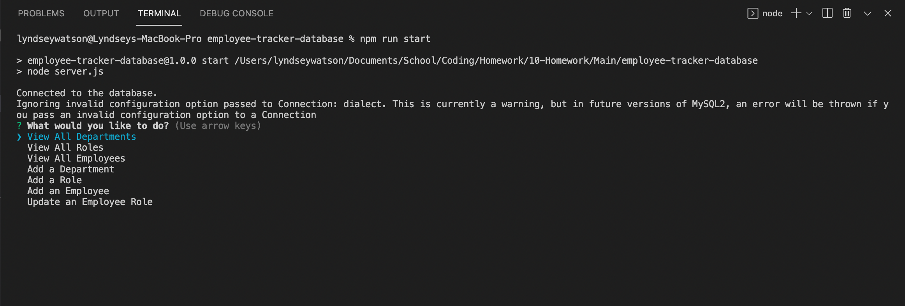
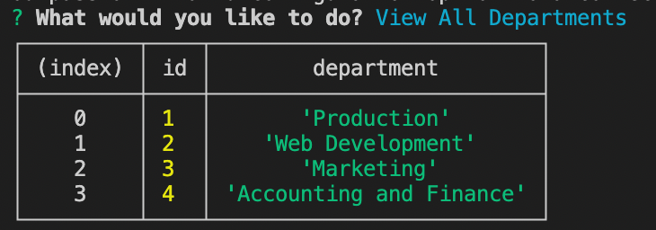
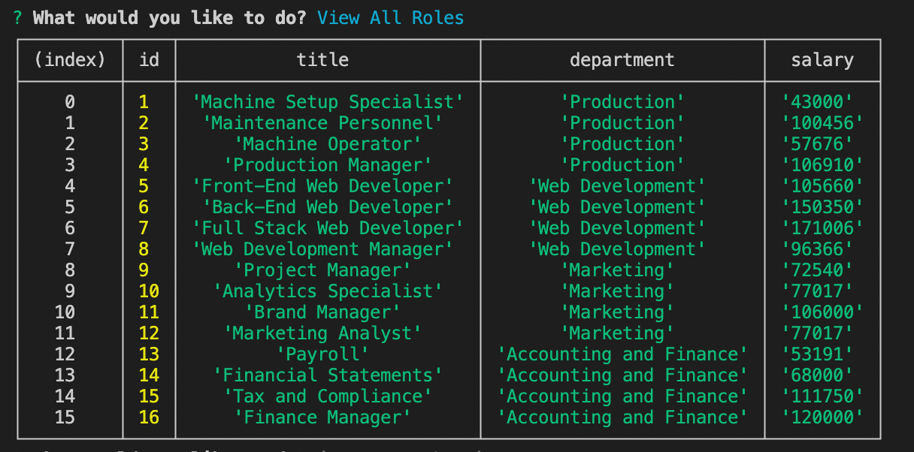
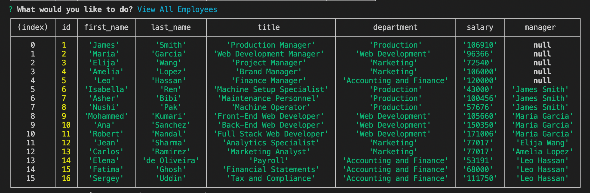
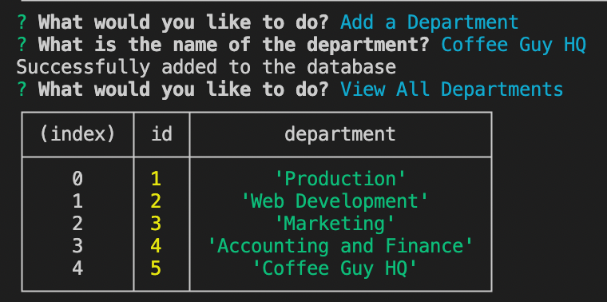
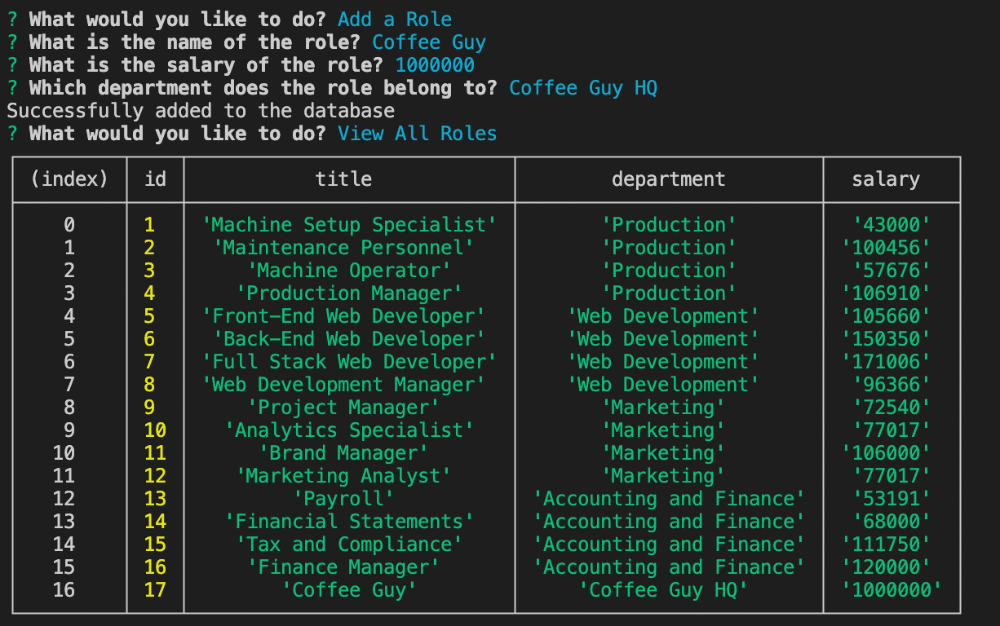
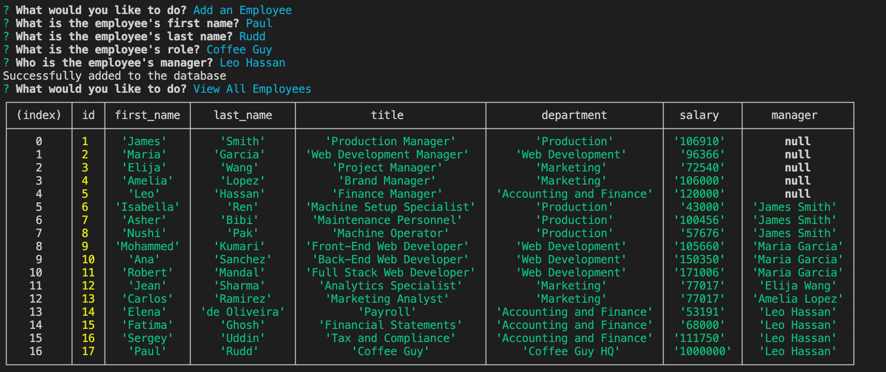
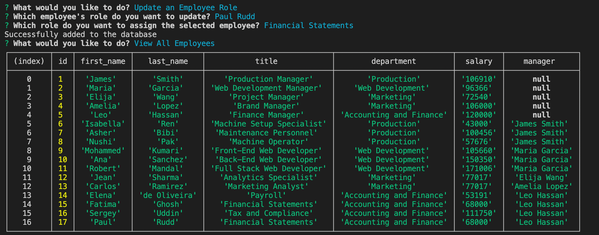

# employee-tracker-database

## An Employee Tracker Database Using Command Line Prompts & MySQL

## Overview

This is a great backend tool that allows users to create a database of all the employees in their company. The information is returned as a table that organizes their information based on department, salary, role title, etc. I was inspired to create this application after learning how to create/update/delete tables within databases & it became a wonderful challenge of how to create relationships between multiple tables of the same database within mySQL. This application combines information over three tables & even combines data from the same table so as to give the user a cohesive response to their requests.

While quite a challenge, this was one of my favorite applications to create because it was a true testament to my problem-solving skills. I found such joy in coming up with many ways to solve problems & was so delighted to achieve a final result that is extremely user friendly and effective. 

This will be a stepping stone to more complex applications I plan to create using mySQL. As you can see from the below video, any departments that are added are then displayed as choice options so soon the user will be able to create information in these tables completely of their own .. they will no longer have to use my starter examples. I will next add a delete function so that every users' database will be unique to their project.

This has also fueled my passion for full stack as I begin the process of implementing API requests & will soon bring an application where users can pull this data to the front end & it will no longer be solely for the use of backend web developers. Stay tuned for upcoming improvements!

## Installation & Usage 

To watch a video of how to deploy the application, I invite you to click here : https://drive.google.com/file/d/1Y8xz6AzSLeE4SS89jjYlznI2y-PvsYNw/view

## Languages & Technologies Used

Javascript, Node, NPMs, mySQL, Sequelize, Inquirer

## License

This project is licensed under the terms of the MIT license. 

## Contributing

You may contact the sole contributor at lyndseyjwatson@gmail.com if you have any questions.

I hope you enjoy!

## Application Screenshots

npm run start : 

View Departments :

View Roles :

View Employees :

Add a Department :

Add a Role : 

Add an Employee : 

Update an Employee : 

